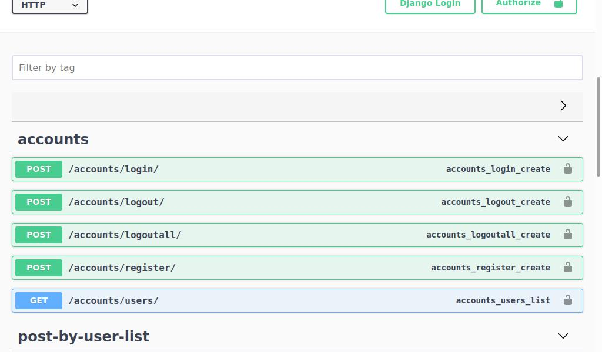

# Social Media API
Social Media API for a backend test

### Running with Docker
Open cmd in the folder where the Dockerfile is located and type the following command:
```
docker build --tag python-django .

```
After successfully building the image type the following command
```
docker run --publish 8000:8000 python-django

```

### API Docs
Navigate to the localhost:8000/ and you should see the API Endpoints


Authentication is made via a POST request to /accounts/register/ with username, email and password as data.

An Authorization Token is returned and this should be used in the following POST/PUT/PATCH requests
